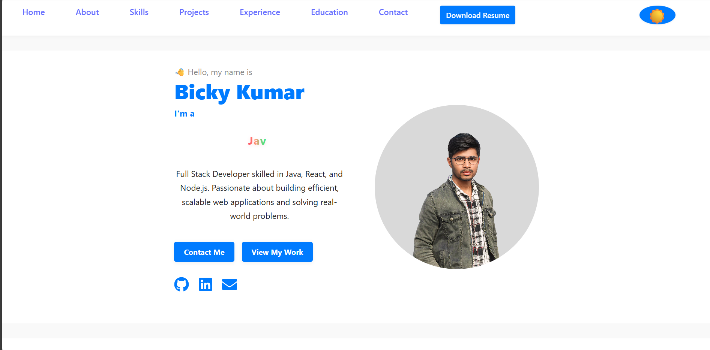

# My Portfolio

[](https://react.dev/)
[](https://vitejs.dev/)
[](https://eslint.org/)

A modern, responsive portfolio website built with React and Vite. Features smooth animations, dark mode, and data-driven project showcases.



## 🚀 Features Implemented

- **Dark Mode Toggle**: Persistent theme switching using `useState` and `localStorage`.
- **AOS Animations**: Initialized in `App.jsx` with `once: true`, `duration: 800`, `easing: 'ease-in-out'`.
- **Responsive Design**: Mobile-first CSS with scroll progress bar and back-to-top button.
- **Data-Driven Projects**: 8 projects loaded from `src/data/projects.js`.
- **Contact Form**: Integrated with EmailJS (`@emailjs/browser`).
- **Performance Optimized**: Vite bundling, lazy loading via sections.

## 📁 Project Structure

```
src/
├── App.jsx              # Main app with dark mode & AOS init
├── App.css              # Global styles
├── main.jsx             # React root
├── components/
│   ├── Navbar.jsx       # Responsive nav with theme toggle
│   ├── BackToTop.jsx    # Scroll-based button
│   └── ScrollProgress.jsx
├── data/
│   └── projects.js      # 8 projects data (title, tech, image, etc.)
└── sections/            # Scrollspy sections
    ├── Home.jsx
    ├── About.jsx
    ├── Skills.jsx
    ├── Projects.jsx
    ├── Testimonials.jsx
    ├── Experience.jsx
    ├── Education.jsx
    └── Contact.jsx
```

## ✨ Code Highlights

### Dark Mode (App.jsx)
```jsx
const [darkMode, setDarkMode] = useState(false);

// Effect for persistence
useEffect(() => {
  document.body.classList.toggle('dark', darkMode);
  localStorage.setItem('darkMode', JSON.stringify(darkMode));
}, [darkMode]);
```

### AOS Initialization
```jsx
useEffect(() => {
  AOS.init({ 
    once: true, 
    duration: 800,
    offset: 100,
    easing: 'ease-in-out'
  });
}, []);
```

### Projects Data Example (projects.js)
```js
const projects = [
  {
    title: 'AgriMarket - E-commerce Platform',
    tech: ['React', 'Node.js', 'MongoDB', 'Express.js', 'Socket.io', 'JWT'],
    // ...
  },
  // 7 more projects...
];
```

## 🛠 Tech Stack

| Category | Technologies |
|----------|--------------|
| Framework | React 19.1.0, React DOM |
| Build Tool | Vite 7.0.0 |
| Animations | AOS 2.3.4 |
| UI/Icons | react-icons 5.5.0 |
| Typing | react-type-animation 3.2.0 |
| Email | @emailjs/browser 4.4.1 |
| Linting | ESLint 9.29.0 + React hooks/plugins |

## 🚀 Quick Start

1. **Clone the repo** (if applicable).
2. **Install dependencies**:
   ```bash
   npm install
   ```
3. **Development server**:
   ```bash
   npm run dev
   ```
   Opens at `http://localhost:5173`.
4. **Build for production**:
   ```bash
   npm run build
   ```
5. **Preview build**:
   ```bash
   npm run preview
   ```

## 📦 Scripts (package.json)

- `npm run dev` - Start dev server
- `npm run build` - Build for production
- `npm run lint` - Run ESLint
- `npm run preview` - Preview production build

## 📝 Notes

- Dark mode class applied to `body`.
- All sections are functional React components.
- Projects section renders dynamically from data.

---

**Built with ❤️ using React & Vite**"

